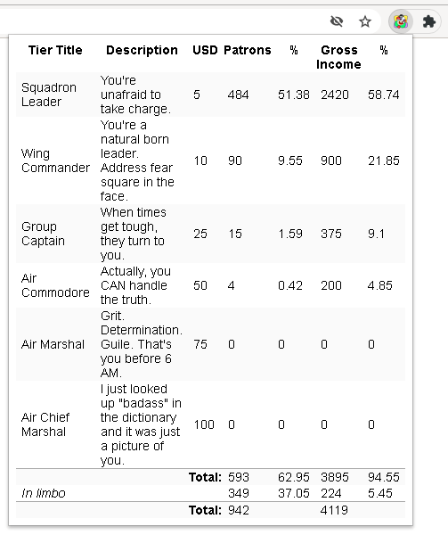

# patreon-patrons-stats

(Download the .crx file [here](http://gromnitsky.users.sourceforge.net/js/chrome/).)

Display a public patrons statistics for a patreon page.

This only works when a "creator" hasn't disabled access to the number
of patrons pledging & total earnings.

Doesn't use `patreon.com` api.

## Compilation

~~~
$ npm -g i crx3-utils json
$ npm i
$ make
~~~

## License

MIT
